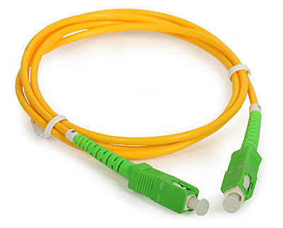

# Orendain-Guifi

Orendaingo Guifi.Net sareareari buruzko eskuliburua.

## Sarrera

Orendaingo Guifi.Net sarearen  elementuak azalduko dira dokumentu honetan, nola konfiguratzen diren, nola konpondu arazoak daudenean, mantenu lanak nola egiten diren eta bezero berriak sarera lotzeko zer egin behar den.

## Sarearen deskribapena

Orendaingo Guifi.Net sarea hiru osagai nagusiz osatuta dago:

* Herriaren zuntz sarea, kultur etxeko rack-etik kaskoko ia etxe guztietara doana. Etxe bakoitzera zuntz dedikatu bat doa, ez da PON erako egitura bat.
* Kultur etxeko rack-a. Bertan router nagusia, zuntza optikoko sitema, antenen alimentagailuak eta UPSa (bateria sistema argia joaten bada) daude. Movistarrek bere FTTH zuntz kaxa bat jarri du rack-aren ondoan.
* Kultur etxeko antenakAntenek zuntza iristen ez den etxeetara ematen du seinalea, Urkolamendiko errepikagailura eta Guifi.Net-eko gainontzeko sarera konektatzea ahalbidetzen du.
* Urkolamendiko errepikagailua. Kultur etxera begira antena bat du eta beste bat seinalea banatzeko.

## Sarearen osagaiak

### Herriko zuntz sarea

Herriko zuntz sarea zuntz monomodo-ko 12 hariko 10 mangeraz osatua dago, arketetan torpedoak daudelarik banatzeko.

### Kultur etxeko rack-eko aparailuak

Kultur etxeko rack-eko aparailuen deskripzioa, goitik behera hasita. 

Aparailua                                                               | Norena                   | Arduraduna    | Zertarako    
------------------------------------------------------------------------|--------------------------|---------------|-------------------------------------------------
Kaskoko etxe bakoitzera zuntz irteerak  (4 rack unitate)                | Orendaingo herriarenak   | ?             | Etxe bakoitzera doan zuntza ordenatuta jartzeko
Zuntza banatzeko espiludun aparailuak (Spliterr-ak)                     | Orendaingo herriarenak   | ?             | OLT-tik irtetzen den argia banatzeko (64 aldiz banatu liteke gehienez)
Huawei SmartAX MA5608T OLT aparailua                                    | Guifi.Net fundazioarena  | ?             | GPON erako zuntza sare bat kudeatze ahalbidetzen du
Mikrotik RB2011 routerra                                                | Orendaino herriarena     | ?             | OLTra konektatutako bezeroak, antenen sarea eta interneterako irteerak kudeatzen ditu
Antenen alimentagailua                                                  | Orendaino herriarena     | ?             | Antenei argi indarra ematen die
Antenetara konexio panela                                               | Orendaino herriarena     | ?             | Antenetara konexioak era txukun batean jartzen ditu

### Kultur etxeko antenak

Kultur etxe gainean antenak daude kokatuta. Antenak dauden egitura Televes etxearen 360 sistemako mastillekin eginda dago, oinarri bat eta puntera bat erabiliz, punteran tubo bat du sartuta. Bientoekin lotuta dago eta guztira 7 metroko altuera izango du. Antenaren oinarritik 80mm-ko bi tubo jaisten dira rack-a dagoen tokira.

Antenen deskribapena goitik behera.

Antena                                                                  | Norena                   | Arduraduna    | Zertarako    
------------------------------------------------------------------------|--------------------------|---------------|-------------------------------------------------
Mikrotik OmniTik antena                                                 | Orendaingo herriarenak   | ?             | Zuntza ez duten etxeei interneta ahalbidetu. Alde guztitara zabaltzen du seinalea (ominidirekzionala da), baina indar gutxirekin
Ubiquiti Rocket M5 + AM-5G20-90 antena - Hegoaldera begira              | Orendaingo herriarenak   | ?             | Zuntza ez duten etxeei interneta ahalbidetu
Ubiquiti Rocket M5 + AM-5G20-90 antena - Iparraldera begira             | Orendaingo herriarenak   | ?             | Zuntza ez duten etxeei interneta ahalbidetu
Ubiquiti NanoBeam                                                       | ?                        | ?             | ?
Ubiquiti PowerBeam - ¿Baliarrainera begira?                             | ?                        | ?             | ¿Baliarraingo udaletxeko Guifi.Net supernodoarekin konektatu?
Ubiquiti PowerBeam - Ollaunera begira                                   | ¿Orendaingo herriarenak? | ?             | Ollaun mendiko Guifi.Net supernodoarekin konektatu
Ubiquiti PowerBeam AC 400 ISO antena - Urkolamendira begira             | Orendaingo herriarenak   | ?             | Urkolamendiko Supernodo errepikagailura konektatu
Ubiquiti PowerBeam AC 620 ISO antena - Usurbera begira                  | Orendaingo herriarenak   | ?             | Usurbeko Guifi.Net supernodoarekin konektatu - Talaia-ren Interneteko sarbidea ahalbidetu

### Urkolamendiko Supernodoa

Ikustera joan behar

## OLTra konektatzeko pausuak

Udaletxeko rack-etik etxeraino zuntza baldin badago eta etxe barruan zuntz kajetina jarrita badin badago, honako osagaiak behar dira konexioa burutzeko:

* ONT aparailu bat
* Bi zuntz kabletxo, bat rack-erako eta bestea etxerako

Osagai horiek edukita, kultur etxeko rack-ean zuntz splitter-etik iterteten den edozein portu etxera doan zuntzera konektatu behar da kabletxo baten bitartez. Etxean berdina egin behar da zuntz kaxetinetik ONTra.

### ONT

ONT aparailuak rack-ean dagoen OLTra konexioa ahalbidetzen du, era desberdinetakoak daude, WiFi-a dutenak, WiFi-rik ez dutenak (kablezko konexioa bakarrik egingo bada), telefono bat konektatzeko aukera ematen dutenak... Huawei etxeko GPON OLT-ekin bateragarria izan behar du ONTak.

Hemen jartzen dira erabiltzeko moduko batzuk, eta beraien ezaugarriak:

ONT modeloa                                                             | Prezioa                  | Non Erosi     | Ezaugarriak
------------------------------------------------------------------------|--------------------------|---------------|-------------------------------------------------
Huawei EG8010H                                                          | EUR 28.9                 | Anvimur.com   | Ez du router edota WiFi funtziorik, aparteko router baten beharra du
Huawei EG8141A5                                                         | EUR 33.9                 | Anvimur.com   | Routerra, 2.4ko WiFi-a, telefonoko toma bat, Gigabit Ethernet bat eta 3 Fast Ethernet ditu
Huawei EG8145V5                                                         | EUR 46.9                 | Anvimur.com   | Routerra, 2.4/5ko WiFi-a, telefonoko toma bat, 4 Gigabit Ethernet eta USBa du

### Zuntz kabletxoak

Bi muturretan SC/APC erako konektoreak dituzten bi kabletxo beharko dira, horrelakoak:

Hemen eros litezke adibidez:

www.anvimur.com/es/material-fibra-optica/1068-latiguillo-scapc-scapc-1m-o3mm.html

### OLTaren konfigurazio

Hau oraindik idazteko... eta ez dirudi erraza izango denik.

## Antena bitartez konektatzeko pausuak

Altena bitartez konektatzeko Orendaingo Guifi.Net sarera honakoak behar dira:

* Udaletxeko edota Urkolamendiko antenera bisibilidadea. Ikusi egin behar da garbi-garbi, tartean zuhaitzak baldin badaude ez du balio.
* Ubiquitiren M5 serieko antena bat. (Zihurtatzeke ea beste markakorenbat konektatu litekeen)
* Mikrotik router bat.

### Antena 

Antenak kable bakrra izaten dute, datuak eta argi indarra daramatena, Etherneteko sareko kable baten bitartez, Power over Ethernet (PoE) sistema erabiliza. Antenari argi indarra bidaltzeko PoE injektore bat erabiltzen da. Ondoren adierazten den bezala:

Ubiquitiren M5 serieko antena bat behar da, hauek dira aukerak:

Antena modeloa                                                          | Prezioa                  | Non Erosi     | Ezaugarriak
------------------------------------------------------------------------|--------------------------|---------------|-------------------------------------------------
Ubiquiti PowerBeam PBE-M5-400                                           | EUR 81.34                | Landashop.com | 25 dBi-ko ganantzia, antenatik bi kilometro baino urrunago egonez gero egokia
Ubiquiti PowerBeam PBE-M5-300                                           | EUR 69.34                | Landashop.com | 22 dBi-ko ganantzia, antenatik bi kilometro baino gertuago egonez gero egokia
Ubiquiti NanoBeam NBE-M5-16                                             | EUR 59.60                | Landashop.com | 16 dBi-ko ganantzia, antenatik kilometro bat baino gertuago egonez gero egokia
Ubiquiti Nanostation Loco M5                                            | EUR 59.77                | Landashop.com | 13 dBi-ko ganantzia, antenatik 500 metro baino gertuago egonez gero egokia

Aukera egiteko orduan dudak izanezgero ganantzia gehiagoko antena hartu, ganantzia gehiagok kalterik ez du egiten. Antena handiagoa izango da, eta garestiagoa baina seinale hobea jasoko du. Baita ere esan beharra dago seinale gehiegi ere txarra dela, bera ez jarri 25 dBi-ko ganantzia duen antena bat antena nagusitik oso gertu.

Antena teilatuan edo tokatzen den lekuan muntatzeko gehigarri hauek interesgarriak dira:

Gehigarria                                                              | Prezioa                  | Non Erosi     | Ezaugarriak
------------------------------------------------------------------------|--------------------------|---------------|-------------------------------------------------
Ubiquiti NBE-WMK                                                        | EUR 1.84                 | Landashop.com | NanoBeam antenak paretean lotzeko lagungarria
Ubiquiti Nanobeam Window Mount 16                                       | EUR 5.34                 | Landashop.com | NanoBeam antenak lehio barrutik bentosa batekin jartzeko

Antenak instalatzeko orduan oso garrantzitsua da antenara doan kablea ona izate, kanpoko eguraldia jasango duena eta apantailatua (FTP) izango dena. Konektoreak ere apantailatuak izan behar dute. 5e kategoriako kablea nahikoa da. 

Talaikide-n Ubiquitiren kable eta konektoreak erabiltzen ditugu bezeroen instalakuntzetarako, zehazki Ubiquiti Tough Cable PRO kablea eta Ubiquiti Tough Connector RJ45 konektoreak.

Oso garrantzitsua da tierrako kablea ondo lotzea konektorean tximistetatik babes egokia izateko, hemen muntaia bideo bat:

https://www.youtube.com/watch?v=xJcttdSkMTU

Antena mastila etxean baldin bada, bertara lotu liteke antena, bestela badaude tximiniari lotzeko abarkoi moduko herraje batzuk, ondorengo argazkitan ikusten diren erakoak:

 

Sistma honek mastil bat jartzea ahalbidetzen du zulorik egin gabe tximinian, fleje galbanizatu batek inguratzen duelarik tximinia eta herrajeak duen karraka baten bitartez tentsatzen dena.

Guk bi leku hauetan erosten ditugu herrajeak:

Pieza                                                                   | Prezioa                  | Non Erosi              | Ezaugarriak
------------------------------------------------------------------------|--------------------------|------------------------|-------------------------------------------------
OK-43T13                                                                | EUR 13.73                | www.delta.poznan.pl    | Kit osoa, herrajeak eta flejea. Poloniako denda da.
ABARCON CHIMENEA PARA FLEJE (Bi behar dira muntai baterako)             | EUR 11.98 Bakoitza       | www.electronicabf.com  | Herrajeak bakarrik. Poloniakoa baino sendoagoa da.
CINTA FLEJE ACERO GALVANIZADO rollo 5 m 0,6x40 mm 	                    | EUR 13.73                | www.electronicabf.com  | Aurreko herrajeentzako flejea.

Antena mastil bezala fontaneriako tubo galbanizatua erabiltzen dugu, pulgada eta laurdenekoa. Oso tubo sendoa da eta galbanizatua gainera.

#### Antenaren konfigurazioa

Antena instalatu ondoren....

Haseran ordenagailu bat konektatu beharko da PoE injetorearen LAN portura eta konfiguratu. Konfiguratu ondoren Routerrera konektatuko dugu.

Ondorengo bideoan nahiko argi azaltzen da nola konektatu antena nagusira gure antena:

https://www.youtube.com/watch?v=HGjUdu0KZzc

### Routerra 

Mikrotik markako routerrak dira erabilienak Guifi.Net sarean, merkeak eta onak direlako. Gainera enrutamendu eta tunelizazio aukera ikaragarriak eskaintzen dituzte, eta antena bidezko sarean beharrezkoak dira gaitasun hauek

Honako modelo hauek proposatzen dira:

Router modeloa                                                          | Prezioa                  | Non Erosi     | Ezaugarriak
------------------------------------------------------------------------|--------------------------|---------------|-------------------------------------------------
Mikrotik hAP Lite classic MKT-RB941-2nD                                 | EUR 18.06                | Landashop.com | Lau Fast Ethernet portu eta 2.4 GHz-eko WiFia
Mikrotik hAP ac lite MKT-RB952Ui-5ac2nD                                 | EUR 39.64                | Landashop.com | Bost Fast Ethernet portu, 2.4 / 5GHz-eko WiFia, USB portua eta antena zuzenean alimentatzeko aukera PoE irteera bidez
Mikrotik hAP ac MKT-RB962UiGS-5HacT2HnT                                 | EUR 101.52               | Landashop.com | Bost Gigabit Ethernet portu, 2.4 / 5GHz-eko WiFia, USB portua eta antena zuzenean alimentatzeko aukera PoE irteera bidez
Mikrotik RB/R2011UiAS-2H-IN                                             | EUR 102.48               | Landashop.com | Bost Gigabit Ethernet portu eta bost Fast Ethernet portu, 2.4 GHz-eko WiFia, USB portua, SFP moduloa erabiltzeko aukera eta antena zuzenean alimentatzeko aukera PoE irteera bidez

#### Routerraren konfigurazioa

Routerraren oinarrizko konfigurazioa egiteko....

IP bat lortu ondoren Guifi.Net-eko web orritik IP hori konfiguratu behar zaio routerrari, Internetera irteteko konexioa dagoen lekurenbatera egin behar da konexio bat, hau Interneteko konexio ornitzailearekin hitzegin beharko da nola egin, edota herriko Internet konexio arduradunarekin. 

## Zuntz optiko bitartez konektatzeko pausuak

Egun, Orendaineko kaskoan zuntz optikoa botata dago ia etxe guztietaraino kultur etxeko rack-etik. Bi eratara eman liteke interneta zuntz optiko sare honen gainean, GPON sistemaren bitartez eta switch baten bitartez. Biak egiteko aukera dago, GPON bitartez egiteko Huawei OLT aparailua erabili behar delarik eta bestela 24 portuko SFP switch-a. Hemen bigarren aukera explikatuko da.

Switch-a erabiliz zuntz optiko bitartez konektatzeko Orendaingo Guifi.Net sarera honakoak behar dira:

* SFP-Ethernet medio konbertidore bat edota SFP modulua duen router bat.
* SFP-tik zuntz monomodo bidirezionaleko adaptadore joku bat (bat alde bakoitzerako).
* Router bat (SFP-ko sarrera badu, medio konbertsorea ez da behar).
* Bi zuntz optiko monomodoko kabletxo, alde batena LC-SCP konektorea eta bastean SC-APC konektorea dutenak.

## Dokumentazioa

Proiektu originalaren dokumentazioa honakoa da:

